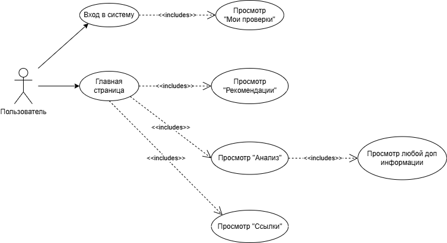

## Use-Case диаграмма

## Check-List тестового покрытия
Авторизация пользователя (TS-001):
- Проверка наличия формы входа на главной странице
- Проверка корректного отображения полей email и пароля
- Проверка валидации полей ввода (пустые значения, неверный формат email)
- Проверка ввода неверных учетных данных (несуществующий email/неправильный пароль)
- Проверка успешной авторизации с валидными данными
- Проверка перенаправления после успешного входа
- Проверка отображения элементов для авторизованного пользователя

Проверка трастовости сайта (TS-002):
- Проверка доступности вкладки "Анализ"
- Проверка обязательности авторизации для выполнения анализа
- Проверка валидации поля ввода URL (пустое значение, некорректный формат)
- Проверка обработки валидного URL сайта
- Проверка отображения результатов анализа (трастовость, ИКС и др.)
- Проверка времени выполнения анализа
- Проверка сохранения истории проверок

Анализ обратных ссылок (TS-003):
- Проверка доступности вкладки "Ссылки"
- Проверка обязательности авторизации для анализа
- Проверка валидации поля ввода URL
- Проверка обработки валидного URL
- Проверка отображения списка обратных ссылок
- Проверка фильтрации и сортировки результатов
- Проверка экспорта результатов (если есть функционал)

Просмотр моих проверок (TS-004):
- Проверка доступности раздела "Аккаунт"
- Проверка перехода в "Мои проверки"
- Проверка отображения истории предыдущих проверок
- Проверка сортировки проверок по дате/типу
- Проверка повторного выполнения проверки из истории
- Проверка удаления проверок из истории

Просмотр рекомендаций (TS-005):
- Проверка доступности вкладки "Рекомендации"
- Проверка отображения заголовка "Рекомендации оптимизаторам"
- Проверка наличия и структуры рекомендаций
- Проверка категоризации рекомендаций
- Проверка кликабельности элементов рекомендаций

Дополнительная информация при анализе (TS-006):
- Проверка раскрытия вкладки "История ИКС"
- Проверка отображения графика изменения ИКС
- Проверка раскрытия вкладки "Изменение ХТ"
- Проверка отображения данных по трафику
- И т.д.
- Проверка работы всех интерактивных элементов на странице результатов

Дополнительные проверки:
- Кросс-браузерная совместимость (Chrome, Firefox, Edge)
- Адаптивность под разные разрешения экрана
- Валидность HTML/CSS
- Проверка скорости загрузки страниц
- Тестирование безопасности (XSS, SQL-инъекции)